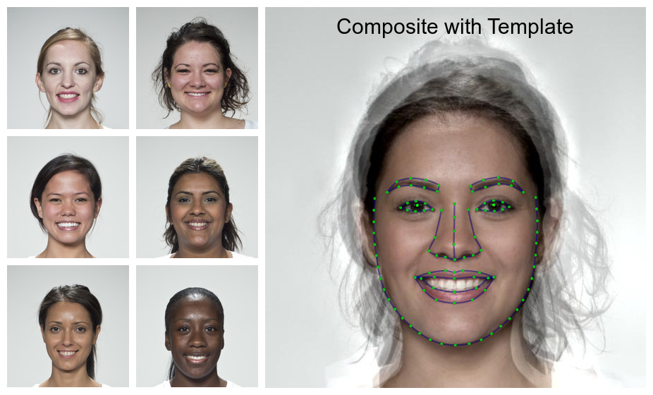

<!-- README.md is generated from README.Rmd. Please edit that file -->

```{r setup, include = FALSE}
knitr::opts_chunk$set(
  collapse = TRUE,
  comment = "#>",
  fig.path = "man/figures/",
  out.width = "100%"
)
```

# webmorphR {style="float:right; width:200px;"}

<!-- badges: start -->
[](https://codecov.io/gh/debruine/webmorphR?branch=master)
[](https://lifecycle.r-lib.org/articles/stages.html#experimental)
[](https://github.com/debruine/webmorphR/actions)
<!-- badges: end -->

The goal of webmorphR is to make the construction of image stimuli more reproducible, with a focus on face stimuli.

This development of this package was funded by ERC grant #647910 (KINSHIP).

## Installation

You can install the development version from [GitHub](https://github.com/) with:

``` r
# install.packages("devtools")
devtools::install_github("debruine/webmorphR")
```

## Use

The code below produces the following figure reproducibly, and can be applied to any set of starting images.



Load images with [psychomorph/webmorph templates](https://debruine.github.io/webmorph/getting-started.html#delineate) or automatically delineate them. Use functions like `resize()`, `align()` and `crop()` to process the images reproducibly. Use webmorph functions to create composite or transformed faces. Use the plotting and labelling functions to create figures.

```{r, eval = FALSE}
library(webmorphR)

# load 6 images from the smiling demo set
original <- demo_stim(dir = "smiling",
                      pattern = "002|013|030|064|094|099") 
# resize and delineate the images (using Face++)
# procrustes align and crop them to 80% size
processed <- original |>
  resize(0.5) |>
  auto_delin(smiling, model = "fpp106") |>
  align(procrustes = TRUE) |>
  crop(width = 0.8, height = 0.8, y_off = 0)

# rename and save individual images
processed |>
  setnames(prefix = "aligned_") |>
  write_stim(dir = "stimuli/smiling")

# average faces (using webmorph.org)
avg <- avg(processed)

# combine individual faces in a grid the same height as the average face
grid <- plot(processed, 
             ncol = 2, 
             external_pad = FALSE,
             maxheight = height(avg))

# draw template on the average face and add a label
tem_viz <- avg |>
  draw_tem() |>
  label(text = "Composite with Template",
        size = 30, location = "+0+10")

# combine the grid and tem_viz images and plot
c(grid, tem_viz) |> 
  plot(nrow = 1, maxwidth = 1500)
```


## Helper packages

There are also two helper packages that contain large demo stimulus files or functions that require python and dlib.

``` r
devtools::install_github("debruine/webmorphR.stim")
devtools::install_github("debruine/webmorphR.dlib")
```


