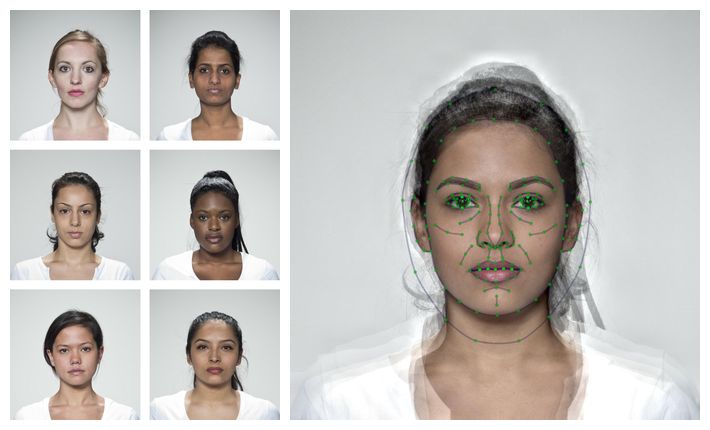

<!-- README.md is generated from README.Rmd. Please edit that file -->

```{r setup, include = FALSE}
knitr::opts_chunk$set(
  collapse = TRUE,
  comment = "#>",
  fig.path = "man/figures/README-",
  out.width = "100%"
)
```

# webmorphR 

{style="float:right; width:200px;"}

<!-- badges: start -->
[](https://codecov.io/gh/debruine/webmorphR?branch=master)
[](https://lifecycle.r-lib.org/articles/stages.html#experimental)
[](https://github.com/debruine/webmorphR/actions)
<!-- badges: end -->

The goal of webmorphR is to make the construction of image stimuli more reproducible, with a focus on face stimuli.

This development of this package was funded by ERC grant #647910 (KINSHIP).

See <https://debruine.github.io/webmorphR/> for details on image manipulations, making figures, and making stimuli.

## Installation

You can install the development version from [GitHub](https://github.com/) with:

``` r
# install.packages("devtools")
devtools::install_github("debruine/webmorphR")
```



## Helper packages

There are also two helper packages that contain large demo stimulus files or functions that require python and dlib.

``` r
devtools::install_github("debruine/webmorphR.stim")
devtools::install_github("debruine/webmorphR.dlib")
```


